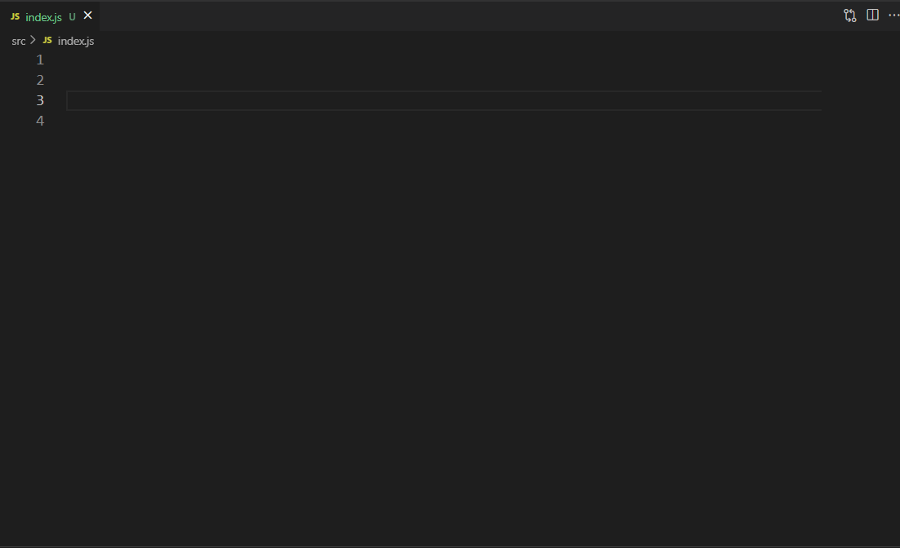

# path-related README

[中文文档](README.md)

The function of this plugin is to provide path completion suggestions and path redirection functionality

It is strongly recommended to disable the automatic path completion function of `vscode` when using this plugin

```json
{ "typescript.suggest.paths": false }
{ "javascript.suggest.paths": false }
```

## Usage



---


## Extension Settings

`pathAlias` Based on the path alias of the current workspace, for example:

```json
{
  "path-related.pathAlias": {
    "@": "${workspaceFolder}/src"
  }
}
```

`ignoreHiddenFiles` Ignore files starting with dots. Default: `false`

```json
{
  "path-related.ignoreHiddenFiles": false
}
```

`ignoreFileExt` The default file suffixes that need to be ignored during path completion: `[".js", ".ts", ".jsx", ".tsx", ".d.ts"]`

```json
{
  "path-related.ignoreFileExt": [".js", ".ts", ".jsx", ".tsx", ".d.ts"]
}
```

`autoNextSuggest` Automatically prompt for the next completion item. Default: `false`

```json
{
  "path-related.autoNextSuggest": false
}
```

`jumpRecognition` When jumping, the recognition rule defaults to: `"Alias Path"`

```json
{
  "path-related.jumpRecognition": "Alias Path"
}
```

`allowSuffixExtensions` Allow file suffixes to be ignored during path jumps

- By default, the `ignoreFileExt` configuration item will be read for suffix completion

```json
{
  "path-related.allowSuffixExtensions": [".vue"]
}
```

## Change Log

see CHANGELOG.md

## Reference

- [Path Intellisense](https://marketplace.visualstudio.com/items?itemName=christian-kohler.path-intellisense)
- [Path Autocomplete](https://marketplace.visualstudio.com/items?itemName=ionutvmi.path-autocomplete)
- [smart-jump](https://marketplace.visualstudio.com/items?itemName=deqiaochen.smart-jump)

**Enjoy!**
