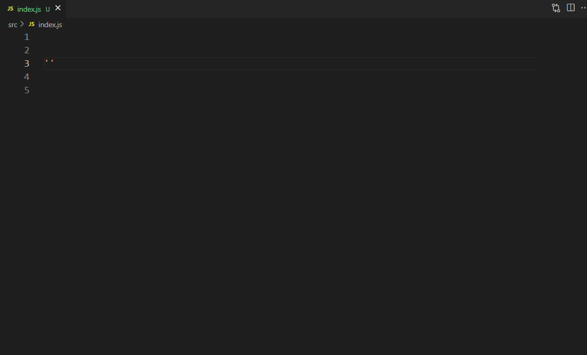

# path-related README

[中文文档](README.md)

The function of this plugin is to provide path completion suggestions and path redirection functionality

It is strongly recommended to disable the automatic path completion function of `vscode` when using this plugin

```json
{ "typescript.suggest.paths": false }
{ "javascript.suggest.paths": false }
```

## Usage


---



## Extension Settings

| Configuration Item    | Description                                                                             | Default Value                                                      |
| --------------------- | --------------------------------------------------------------------------------------- | ------------------------------------------------------------------ |
| pathAlias             | Based on the path alias of the current workspace, for example: `@` maps to `src` folder | `{"@": "${workspaceFolder}/src"}`                                  |
| ignoreHiddenFiles     | Ignore files starting with dots                                                         | `false`                                                            |
| ignoreFileExt         | The default file suffixes that need to be ignored during path completion                | `[".js", ".ts", ".jsx", ".tsx", ".d.ts"]`                          |
| autoNextSuggest       | Automatically prompt for the next completion item                                       | `false`                                                            |
| jumpRecognition       | When jumping, the recognition rule defaults to: `"Alias Path"`                          | `"Alias Path"`                                                     |
| allowSuffixExtensions | Allow file suffixes to be ignored during path jumps                                     | `["vue"]` (defaults to reading `ignoreFileExt` configuration item) |
| depsJumpAndTip        | Should dependency paths be prompted simultaneously during path jumps and path prompts?  | `false`                                                            |
| openTreeView          | Automatically associate the document with the corresponding file view when opened       | `["node_modules"]`                                                 |
| enableTreeView        | Whether to enable the file view                                                         | `false`                                                            |

## Change Log

see CHANGELOG.md

## Reference

- [Path Intellisense](https://marketplace.visualstudio.com/items?itemName=christian-kohler.path-intellisense)
- [Path Autocomplete](https://marketplace.visualstudio.com/items?itemName=ionutvmi.path-autocomplete)
- [smart-jump](https://marketplace.visualstudio.com/items?itemName=deqiaochen.smart-jump)

**Enjoy!**
