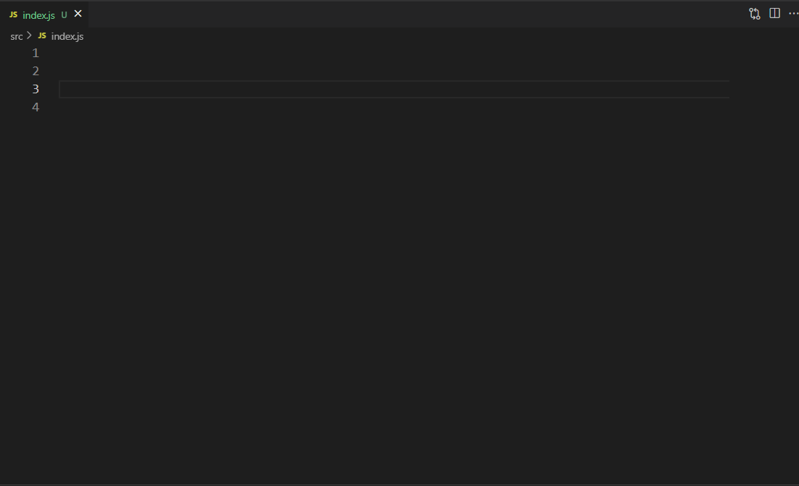
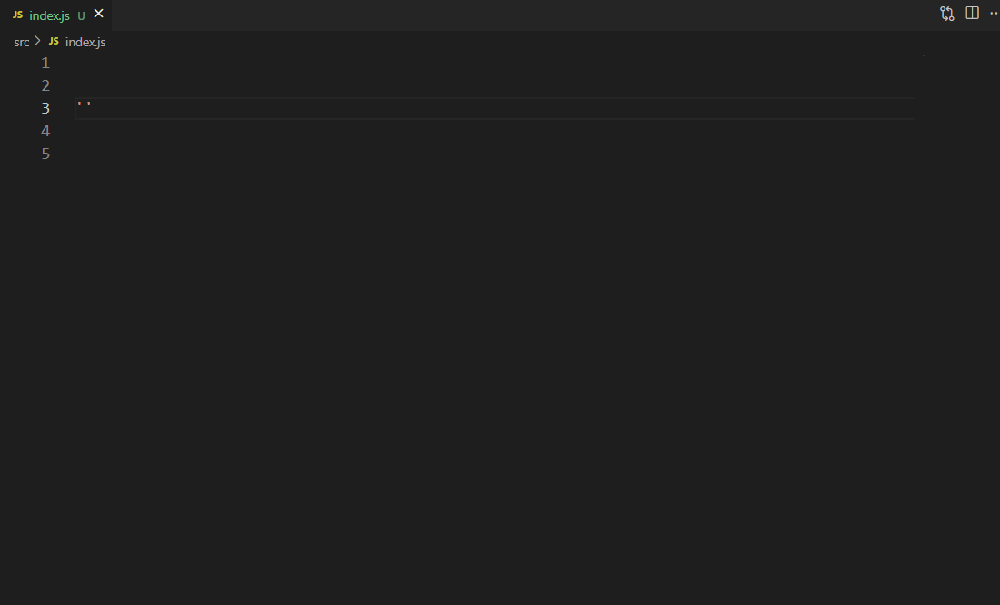

# path-related README

[English](README.EN.md)

这个插件的功能就是提供路径补全建议和路径跳转功能

使用此插件强烈建议关闭 `vscode` 的路径自动补全功能

```json
{ "typescript.suggest.paths": false }
{ "javascript.suggest.paths": false }
```

## Usage



---



## Extension Settings

`pathAlias` 基于当前工作区的路径别名，例如：

```json
{
  "path-related.pathAlias": {
    "@": "${workspaceFolder}/src"
  }
}
```

`ignoreHiddenFiles` 忽略以点开头的文件 默认: `false`

```json
{
  "path-related.ignoreHiddenFiles": false
}
```

`ignoreFileExt` 在路径补全时需要忽略的文件后缀 默认: `[".js", ".ts", ".jsx", ".tsx", ".d.ts"]`

```json
{
  "path-related.ignoreFileExt": [".js", ".ts", ".jsx", ".tsx", ".d.ts"]
}
```

`autoNextSuggest` 自动提示下一个补全项 默认: `false`

```json
{
  "path-related.autoNextSuggest": false
}
```

`jumpRecognition` 跳转时识别规则 默认: `"Alias Path"`

```json
{
  "path-related.jumpRecognition": "Alias Path"
}
```

`allowSuffixExtensions` 在路径跳转时允许忽略的文件后缀

- 默认会读取 `ignoreFileExt` 配置项进行后缀补全

```json
{
  "path-related.allowSuffixExtensions": [".vue"]
}
```

## Change Log

see CHANGELOG.md

## Reference

- [Path Intellisense](https://marketplace.visualstudio.com/items?itemName=christian-kohler.path-intellisense)
- [Path Autocomplete](https://marketplace.visualstudio.com/items?itemName=ionutvmi.path-autocomplete)
- [smart-jump](https://marketplace.visualstudio.com/items?itemName=deqiaochen.smart-jump)

**Enjoy!**
